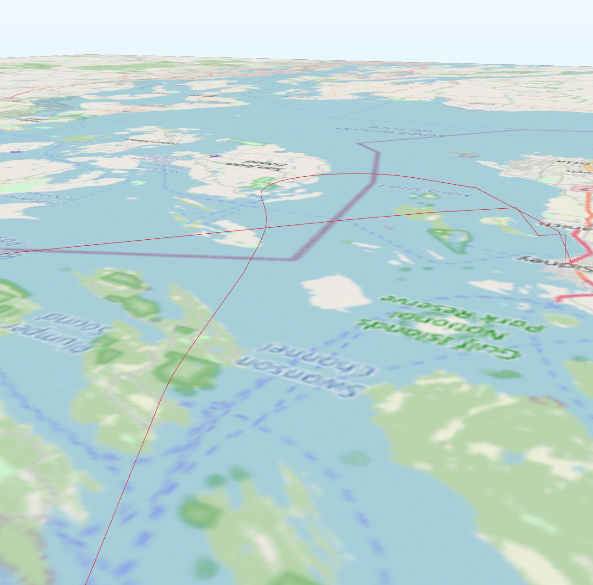
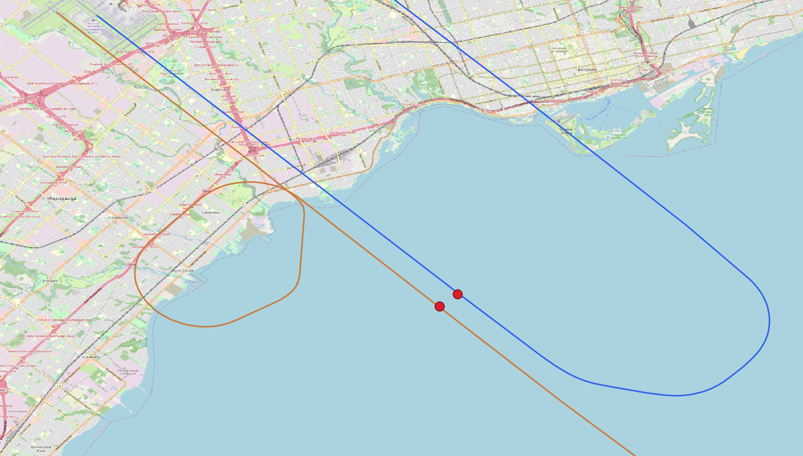

## ADS-B data

Can standard geospatial tools be used with transmissions from [Automatic Dependent Surveillance-Broadcast](https://en.wikipedia.org/wiki/Automatic_Dependent_Surveillance%E2%80%93Broadcast) (ADS-B) equipment aboard aircraft? I wanted to find out because unlike most geospatial data, ADS-B has a third dimension *and* a fourth dimension.

My geospatial analysis tool of choice is PostGIS, which has multidimensional geometry types and functions, but I had never really had cause to use them despite having coded support for additional dimensions when I developed [plpygis](https://plpygis.readthedocs.io/en/latest/).

This article describes the process of getting free ADS-B data, loading it into PostgreSQL and then manipulating it with PostGIS and Python.

### Tools

In addition to PostgreSQL and PostGIS, I used two Python modules: [requests](https://docs.python-requests.org/en/latest/) and [plpygis](https://plpygis.readthedocs.io/en/latest/). These *must* be installed in a location from which PostgreSQL’s [PL/Python](https://www.postgresql.org/docs/current/plpython.html) can import them. I also used [QGIS](https://qgis.org/) for visualization.

### Aircraft identities

Step one was learning about [ICAO 24 addresses](https://en.wikipedia.org/wiki/Aviation_transponder_interrogation_modes#ICAO_24-bit_address), unique aircraft identifiers which are included in every ADS-B transmission.[^icao24] These are 24-bit values represented by a six-digit hexadecimal number, such as `A4DA1`. These codes are distinct from the registration numbers that are visible on an aircraft's body or tail.


A single physical aircraft may have multiple ICAO 24 addresses over its lifetime but these change much less frequently than registration numbers.

)")

The ATR-42 in the image above has moved between three airlines and therefore been registered under three different numbers … but also with two different ICAO 24 codes, `3a2270` and `39ad00`. The history of these alterations can be found in some databases, such as the one maintained by [Planespotters.net](https://www.planespotters.net/airframe/atr-42-f-hlia-amelia-international/e241md).

### The OpenSky Network

The [The OpenSky Network](https://opensky-network.org/) provides free access to ADB-S data via a RESTful API. There is a [Python client](https://openskynetwork.github.io/opensky-api/python.html), but I did not use it since it doesn’t implement everything that is available directly through the API.

An ICAO 24 address[^case] is the basis for most OpenSky API calls, although it is possible to request data by searching for activity at a particular airport or region.

I created a free OpenSky account since the API documentation states that the [rate limits](https://openskynetwork.github.io/opensky-api/rest.html#limitations) are stricter for anonymous users. And although my experience is that the API behaviour does not always match the documentation, it seemed like a good idea to do what they recommend in this case.

#### State vectors

Equipped with an ICAO 24 number, I retrieved some actual flight data provided by OpenSky. A basic query also requires a specific time, with that time being represented as the number of seconds elapsed since the 1st of January 1970 (otherwise known as UNIX time). For example, the position of the ATR-42 above at 16:01:23 on the 11th of April, 2022 is requested by https://opensky-network.org/api/states/all?icao24=39ad00&time=1649692883.

The [JSON](https://www.json.org/)-encoded response looks like the following:

```json
{
  "time": 1649692883,
  "states": [
    [
      "39ad00",
      "AFR57AG ",
      "France",
      1649692879,
      1649692882,
      2.5172,
      44.9426,
      2263.14,
      false,
      100.86,
      24.08,
      10.08,
      null,
      2316.48,
      null,
      false,
      0
    ]
  ]
}
```

The data transmitted by the aircraft is stored in the list of states and can be decoded through the [OpenSky documentation](https://openskynetwork.github.io/opensky-api/rest.html#response). From this you know that the aircraft was operating as [Air France 57AG](https://flightaware.com/live/flight/AFR57AG), that it recorded a barometric altitude of 2263.14 meters, that it had a ground speed of 100.86 meters/second and so on.

Back to my Il-76 in Tashkent, [planefinder](https://planefinder.net/data/aircraft/UK-76428) tells me that the ICAO 24 code associated with UK-76428 is `507f87`. As it turns out, OpenSky doesn’t have any records of that particular airplane flying, which is, I suppose, an answer to my original question of what these planes might be up to: not much, or at least not much in the range of a receiver operated by someone participating in the OpenSky Network. But there are plenty of other planes in the sky to look at!

#### Tracks

OpenSky simplifies getting a series of state vectors by providing a tracks API endpoint, and although [the documentation](https://openskynetwork.github.io/opensky-api/rest.html#track-by-aircraft) states that this endpoint is [experimental](https://github.com/openskynetwork/opensky-api/commit/fba493cfee35dfc6f1d1f01f84f68c4d04ab781d), I’ve had success in using it: https://opensky-network.org/api/tracks/?icao24=39ad00&time=1649692883.

The response to the request above will contain some basic facts about the flight, including the first and last times at which it was observed:

```json
{
  "icao24": "39ad00",
  "callsign": "AFR57AG ",
  "startTime": 1649692883,
  "endTime": 1649696435,
  "path": [...]
}
```

The `path` element is a list of abbreviated state vectors showing the route the aircraft took on this flight. One of these vectors might look like the following:

```json
[
  1649693075,
  45.129,
  2.631,
  3352,
  23,
  false
]
```

These values are the time, latitude, longitude, barometric altitude, heading and whether the aircraft is on the ground respectively.[^2]

The one significant limitation with OpenSky is that these flight tracks are only available for flights from the last 30 days.

#### Flights

The next endpoint that we’ll be using is `/flights/aircraft`, which lists all the flights taken by an aircraft: https://opensky-network.org/api/flights/aircraft/?icao24=39ad00&begin=1609455600&end=1609714800.

One flight in the list looks like the following:

```json
{
  "icao24": "39ad00",
  "firstSeen": 1649692883,
  "estDepartureAirport": "LFLW",
  "lastSeen": 1649696438,
  "estArrivalAirport": "LFPO",
  "callsign": "AFR57AG ",
  "estDepartureAirportHorizDistance": 9750,
  "estDepartureAirportVertDistance": 1654,
  "estArrivalAirportHorizDistance": 3750,
  "estArrivalAirportVertDistance": 33,
  "departureAirportCandidatesCount": 0,
  "arrivalAirportCandidatesCount": 9
}
```

The departure and arrival airports are estimates since these are not explicitly reported by the ADB-S data, so OpenSky infers them from what it observes; on occasion you will see an airport listed as `null` when there wasn’t enough data to establish what the plane’s origin or destination were.

Any time between `firstSeen` and `lastSeen` can be used with the `/tracks` endpoint above to get the entire path that the plane took on this flight.

#### Airport activity

Two final endpoints that are interesting are `/flights/arrival` and `/flights/departure`, which will list all the flights that terminate or originate at a particular airport between two points in time.

## ADS-B data in PostGIS

### Database creation

Once PostgreSQL and PostGIS are installed and your user has the right privileges, you can run the following on the command line:

```bash
createdb opensky
```

Then open the database to interact with it:

```bash
pgsql opensky
```

You first need to enable PostGIS:

```postgresql
CREATE EXTENSION postgis;
```

Create the table to store the flight data:

```postgresql
CREATE TABLE flight (
  icao24   TEXT,
  callsign TEXT,
  dep_airp TEXT, -- departure airport
  arr_airp TEXT, -- arrival airport
  dep_time TIMESTAMP, -- departure time
  arr_time TIMESTAMP, -- arrival time
  geom GEOMETRY(LINESTRINGZM, 4326)
);
```

The geometry type `LINESTRINGZM` means that each vertex in the path will have four dimensions: x and y (longitude and latitude), z (altitude) and m (the “measure” value, which will be used for time).

Finally, add an index but make it n-dimensional, which optimizes queries across all four dimensions.

```postgresql
CREATE INDEX ON
  flight
USING
  gist (geom gist_geometry_ops_nd);
```

### PL/Python

There are a few ways to bring the data from the  OpenSky API into the database, but I used PL/Python, which means we’ll write a function in Python that will be run from inside the database. To make it easier to work with PostGIS, I also used [plpygis](https://plpygis.readthedocs.io/en/latest/), a small Python module that I created to help write PL/Python functions for geospatial data.

Start by enabling PL/Python:

```postgresql
CREATE LANGUAGE plpython3u;
```

Let’s start with a simple function that gets a list of flights an aircraft took between two dates. I provided my OpenSky credentials in the environment variables ``OPENSKY_USER`` and ``OPENSKY_PASS``, but they could also be set directly in the script.

```plpgsql
CREATE OR REPLACE FUNCTION
    get_aircraft_flights(icao24 TEXT, in_datebegin DATE, in_dateend DATE)
RETURNS
    TABLE (LIKE flight)
AS $$
    import os
    OSUSER = os.getenv("OPENSKY_USER")
    OSPASS = os.getenv("OPENSKY_PASS")
    OSURL = "https://opensky-network.org/api"

    from datetime import datetime
    from dateutil import parser
    from requests import Session
    from requests.auth import HTTPBasicAuth

    db = parser.parse(in_datebegin)
    de = parser.parse(in_dateend).replace(hour=23, minute=59)
    db = int(db.timestamp())
    de = int(de.timestamp())

    opensky = Session()
    opensky.auth = HTTPBasicAuth(OSUSER, OSPASS)

    res = opensky.get(
              OSURL + "/flights/aircraft/",
              params={"icao24" : icao24,
                      "begin" : db,
                      "end" : de})

    if res.status_code == 200 and res.text:
        plpy.info(res.request.url)
        flights = [(icao24,
                    f["callsign"].strip() if f["callsign"] else "",
                    f["estDepartureAirport"],
                    f["estArrivalAirport"],
                    datetime.fromtimestamp(f["firstSeen"]),
                    datetime.fromtimestamp(f["lastSeen"]),
                    None)
                   for f in res.json()]
        return flights
    else:
        plpy.info(res.request.url, res.status_code, res.text)
        return []

$$ LANGUAGE plpython3u;
```

The function definition `get_aircraft_flights` takes three arguments, the ICAO 24 code discussed above plus a start and an end date. Returning `TABLE (LIKE flight)` is a rather useful way that PostgreSQL lets you force the output of a function to match exactly the definition of a table.[^table]

The function makes a call to the OpenSky API to get all the flights for the aircraft between the two dates, and returns the results. It does not fill in the track for each flight, but we can write another function to do that:

```plpgsql
CREATE OR REPLACE FUNCTION
    get_track(icao24 TEXT, in_date TIMESTAMP WITH TIME ZONE)
RETURNS
    GEOMETRY(LINESTRINGZM, 4326)
AS $$
    import os
    OSUSER = os.getenv("OPENSKY_USER")
    OSPASS = os.getenv("OPENSKY_PASS")
    OSURL = "https://opensky-network.org/api"

    from datetime import datetime
    from dateutil import parser
    from requests import Session
    from requests.auth import HTTPBasicAuth
    from plpygis import LineString

    dt = parser.parse(in_date)
    dt = int(dt.timestamp())

    opensky = Session()
    opensky.auth = HTTPBasicAuth(OSUSER, OSPASS)

    res = opensky.get(
                OSURL + "/tracks/",
                params={"icao24" : icao24.lower(),
                        "time" : dt})
    if res.status_code == 200 and res.text:
        plpy.info(res.request.url)
        fl = res.json()
        return LineString(
                    [[v[2], v[1], v[3], v[0]]
                    for v in fl["path"]])
    else:
        plpy.info(res.request.url, res.status_code, res.text)
        return None
$$ LANGUAGE plpython3u;
```

Now you can use SQL on the results of this function as if it were a normal database table. For example if you want to know all the unique flight numbers flown by `39ad00` in the first week of May, you can query the OpenSky API like this:

```postgresql
SELECT
  DISTINCT callsign
FROM
  get_aircraft_flights('c05f01', '2022-05-01', '2022-05-07');
```

```sql
 callsign
----------
 JZA653
 JZA652
 JZA270
 JZA283
 JZA651
 JZA161
 JZA399
 JZA300
 JZA157
 JZA460
 JZA801
 JZA349
 JZA279
 JZA322
 JZA658
 JZA164
 JZA282
 JZA153
 JZA156
 JZA295
 JZA147
 JZA400
 JZA810
 JZA800
 JZA654
 JZA803
 JZA160
 JZA459
```

One issue that you will observe doing the above is that you are pulling data from the API with every query. It will be much better to have a local copy of the data to work with:

```postgresql
INSERT INTO
  flight
SELECT
  *
FROM
  get_aircraft_flights('c05f01', '2022-05-01', '2022-05-07');
```

Now the same queries can be run locally from our `flight` table:

```postgresql
SELECT DISTINCT
  callsign
FROM
  flight;
```

And how do we add the tracks?

```postgresql
UPDATE
  flight
SET
  geom = get_track(icao24, dep_time)
WHERE
  date(dep_time) = '2022-05-01';
```

Remove the WHERE clause and you’ll add tracks to all the flights in your table (which could take a very long time depending on what you have put in there). To add geometries to all the flights without them, you can change the where clause to `WHERE geom IS NULL`.

And, of course, you can hook the table up to QGIS to see those flight paths.


### Geospatial queries

With the data in PostGIS, let’s do some analysis.

Let’s start easy and say that you want to know how many kilometers `39ad00` flew on the 1st of May:

```postgresql
SELECT
  count(*) AS flights,
  SUM(ST_Length(geom::geography)) / 1000 AS distance
FROM
  flight
WHERE
  date(dep_time) = '2022-05-01';
```

```sql
 flights |     distance
---------+-------------------
       5 | 1499.689291267288
```

A little more advanced is seeing how often `39ad00` flew between two Canadian airports but travelled over the landmass of the United States to get there. To do this, I downloaded the administrative boundaries data set from [NaturalEarth](https://www.naturalearthdata.com/http//www.naturalearthdata.com/download/10m/cultural/ne_10m_admin_0_countries.zip) and after unzipping it, I loaded it into the `opensky` database:

```bash
shp2pgsql -s 4326 -g geom ne_10m_admin_0_countries.shp country | psql opensky
```

And the I ran the following query to find instances when the start and end of a flight were in Canada but at some point the flight path intersected with US territory:

```postgresql
SELECT
  f.callsign, f.dep_time, f.dep_airp, f.arr_airp
FROM
  flight AS f, country AS usa, country AS canada
WHERE
  usa.name = 'United States of America' AND
  canada.name = 'Canada' AND
  ST_Intersects(canada.geom, ST_StartPoint(f.geom)) AND
  ST_Intersects(canada.geom, ST_EndPoint(f.geom)) AND
  ST_Intersects(usa.geom, f.geom);
```

```postgresql
 callsign |      dep_time       | dep_airp | arr_airp
----------+---------------------+----------+----------
 JZA474   | 2022-05-13 01:10:16 | CYCD     | CYYC
```

Showing that particular flight in QGIS, we can see how it did, in fact, pass over the United States during its flight.


## Going multidimensional

### Crossed Paths

With some data in our `flight` table, we can do multidimensional analysis using three dimensions as described in the [PostGIS documentation](https://postgis.net/workshops/postgis-intro/3d.html).

Let's start by seeing if any of the flights had an exact intersections of their flight paths.

```postgresql
SELECT
  a.callsign, a.dep_time,
  b.callsign, b.dep_time,
  ST_AsText(ST_Intersection(a.geom, b.geom))
FROM
  flight AS a, flight AS b
WHERE
  a.dep_time > b.dep_time AND
  ST_Intersects(ST_Force3D(a.geom), ST_Force3D(b.geom));
```

Note that we are forcing the geometries to be three-dimensional and not four-dimensional. A two-dimentional intersection would ignore altitude completely, while a four-dimensional intersection would be asking for two planes that crossed paths at the exact same point at the exact same time, otherwise known as a mid-air collision.

Among the results is something like this, where we can see the exact three-dimensional point at which the paths of Jazz Air flights 168 and 150 intersected one another.

```
 JZA168   | 2022-06-07 04:49:17 | JZA150   | 2022-06-06 18:15:24 | POINT Z (-123.28160909937012 48.72753520085094 609)
```

The intersection point is expressed in three-dimensional [WKT](https://en.wikipedia.org/wiki/Well-known_text_representation_of_geometry), `POINT Z (-123.28160909937012 48.72753520085094 609)`, where the `609` indicates that the planes were at an altitude of 609 metres or about 2000 feet, a reasonable altitude for planes on approach to an airport.



Click <a href="map/index.html" target="_blank">here</a> to see the 3d model above (vertical scale has been exaggerated).

### Four dimensions

#### Closest points of approach

A four-dimensional intersection is a mid-air collision, and Canada's Civil Aviation Daily Occurrence Reporting System has a queryable database of "occurrences" on the [Transport Canada website](https://wwwapps.tc.gc.ca/Saf-Sec-Sur/2/cadors-screaq/ws.aspx). By filtering on the string "TCAS"[^tcas], I found [the following incident](https://wwwapps.tc.gc.ca/saf-sec-sur/2/cadors-screaq/rd.aspx?occdtefrom%3d2022-06-12%26occdteto%3d2022-07-13%26srchfldcd%3d6%26txt%3dTCAS%26srchtype%3d1%26rt%3dWS%26hypl%3dy%26cnum%3d2022O1187):

>  UPDATE: TSB Report #A22O0076: C-FAXD, a Boeing 737 MAX 8 aircraft operated by Sunwing Airlines Inc, was conducting flight SWG443 from Punta Cana International Airport (PUJ/MDPC), Dominican Republic, to Toronto Pearson International Airport (CYYZ), ON. While on final approach into CYYZ for Runway 33L, the flight crew received a Traffic Alert and Collision Avoidance System (TCAS) resolution advisory (RA) with C-GJVT, an Airbus 320-200 aircraft operated by Air Canada conducting flight ACA264 from Winnipeg/James Armstrong Richardson International Airport (CYWG), MB, to CYYZ, which was on final approach for Runway 33R. SWG443 followed the TCAS RA and aborted the approach to the left. Both aircraft came to a minimum lateral separation of 0.6 Nautical Miles and a minimum vertical separation of 500 feet. SWG443 was at an altitude of 3500 feet and ACA264 at 3000 feet, abeam to each other, on approach for Runways 33L and 33R. SWG443 and ACA264 landed without further incident. 

I wanted to see if I could replicate this narrative in ADS-B data. The first problem is that all the data in the `flight` table comes from the same airplane, so I added a new function that ingests all the tracks arriving or departing from a specific airport.


```plpgsql
CREATE OR REPLACE FUNCTION
    get_airport_flights(airport TEXT, in_datebegin DATE, in_dateend DATE)
RETURNS
    TABLE (LIKE flight)
AS $$
    import os
    OSUSER = os.getenv("OPENSKY_USER")
    OSPASS = os.getenv("OPENSKY_PASS")
    OSURL = "Thttps://opensky-network.org/api"

    from datetime import datetime
    from dateutil import parser
    from requests import Session
    from requests.auth import HTTPBasicAuth

    db = parser.parse(in_datebegin)
    de = parser.parse(in_dateend).replace(hour=23, minute=59)
    db = int(db.timestamp())
    de = int(de.timestamp())

    opensky = Session()
    opensky.auth = HTTPBasicAuth(OSUSER, OSPASS)

    for endpoint in ["arrival", "departure"]:
      res = opensky.get(
                OSURL + "/flights/{}/".format(endpoint),
                params={"airport" : airport,
                        "begin" : db,
                        "end" : de})

      if res.status_code == 200 and res.text:
          plpy.info(res.request.url)
          for f in res.json():
            if not f["firstSeen"] or not f["lastSeen"]:
              continue
            yield (f["icao24"],
                   f["callsign"].strip() if f["callsign"] else "",
                   f["estDepartureAirport"],
                   f["estArrivalAirport"],
                   datetime.fromtimestamp(f["firstSeen"]),
                   datetime.fromtimestamp(f["lastSeen"]),
                   None)
      else:
          plpy.info(res.request.url, res.status_code, res.text)

$$ LANGUAGE plpython3u;
```

I populated it with the flights to and from CYYZ on the date of the incident.

```postgresql
CREATE TABLE tcas (LIKE flight);
```

```postgresql
INSERT INTO tcas
SELECT
  *
FROM
  get_airport_flights('CYYZ', '2022-06-18', '2022-06-18');
```
I could have ingested all the tracks for every row in the table, but since I already knew the affected flights, I just focused on those.

```postgresql
UPDATE
  tcas
SET
  geom = get_track(icao24, dep_time)
WHERE
  callsign IN ('ACA264', 'SWG443');
```

After adding the tracks, the PostGIS function `ST_ClosestPointOfApproach` can tell us where along the timelines of two flights are they at their closest proximity. We will, however, want to have the geometry reprojected into a spatial reference system that makes distance calculations using metres - not latitude and longitude - since that is what the altitude is measured in. Since the data set is clustered around Toronto, EPSG:7991 is a good choice.

`ST_ClosestPointOfApproach` finds the measure value at which two tracks are closest to one another. `ST_DistanceCPA`provides the actual three-dimensional distance between the two tracks at this closest point of approach.


```postgresql
WITH flights AS (
  SELECT
    a.callsign AS fa,
    b.callsign AS fb,
    ST_Transform(a.geom, 7991) AS ga,
    ST_Transform(b.geom, 7991) AS gb
  FROM
    tcas AS a, tcas AS b
  WHERE
    a.callsign = 'ACA264' AND
    b.callsign = 'SWG443'    
), cpa AS (
  SELECT
    fa, fb, ga, gb,
    ST_ClosestPointOfApproach(ga, gb) AS m
  FROM
    flights
), points AS (
  SELECT
    fa,
    fb,
    ST_Force3DZ(ST_GeometryN(ST_LocateAlong(ga, m), 1)) AS pa,
    ST_Force3DZ(ST_GeometryN(ST_LocateAlong(gb, m), 1)) AS pb,
    ST_DistanceCPA(ga, gb) AS distance,
    m
  FROM
    cpa
)
SELECT
  to_timestamp(m) AT TIME ZONE 'UTC' AS time,
  round(distance) AS separation,
  round(ST_Distance(ST_Force2D(pa), ST_Force2D(pb))) AS lateral_separation,
  round(abs(ST_Z(pa) - ST_Z(pb))) AS vertical_separation,
  fa AS a,
  fb AS b,
  ST_AsText(ST_Transform(pa, 4326), 3) AS a_position,
  ST_AsText(ST_Transform(pb, 4326), 3) AS b_position
FROM
  points;
```

According to Transport Canada, the lateral separation at 22:39 UTC should be 0.6 nautical miles, which is is 1111 metres, and the vertical separation should be approximately 500 feet. The ADS-B data doesn't exactly replicate those findings but it's not hugely far off.

```
        time         | separation | lateral_separation | vertical_separation |   a    |   b    |            a_position            |          b_position          
---------------------+------------+--------------------+---------------------+--------+--------+----------------------------------+------------------------------
 2022-06-18 22:38:07 |       1119 |               1075 |                 310 | ACA264 | SWG443 | POINT Z (-79.448 43.542 604.234) | POINT Z (-79.457 43.536 914)
```

The altitude of the two flights does not match the altitudes stated by Transport Canada; however, the altitude reported by these two aircraft on the ground at Toronto was 0, so adding ~170m to account for the airport's elevation does bring us into that range.



#### Searching for near misses

Lastly, I wanted to see if there were any "close calls" like the one above that were *not* reported in the Transport Canada database.

Let's load the in-bound and out-bound flights at Victoria International Airport (YYJ) on a single day:

```postgresql
INSERT INTO flight
SELECT
  *
FROM
  get_airport_flights('CYYJ', '2022-06-15', '2022-06-15');
```
From this we will see for all flights that have any temporal overlap, there is a single time at which the two flights were closest to one another.

```postgresql
SELECT
  to_timestamp(ST_ClosestPointOfApproach(ST_Transform(a.geom, 3005), ST_Transform(b.geom, 3005))) AS time,
  a.callsign AS flight_a,
  b.callsign AS flight_b
FROM
  flight as a, flight as b
WHERE
  a.dep_time > b.dep_time AND
  ST_ClosestPointOfApproach(a.geom, b.geom) IS NOT NULL;
```

An abbreviated output would look like the following:

```sql
             time              | flight_a | flight_b
-------------------------------+----------+----------
 2022-06-15 16:50:34.289124+02 | WSW209   | ROU1901
 2022-06-15 16:13:25+02        | WSW209   | MAL8072
 2022-06-15 16:13:25+02        | WSW209   | WJA209
 2022-06-15 23:20:26+02        | ASP654   | WJA196
 2022-06-15 23:16:29.999995+02 | ASP654   | FLE515
 2022-06-15 23:01:11+02        | ASP654   | CGFHA
 2022-06-15 23:11:15+02        | ASP654   | CL604KGN
 2022-06-15 23:01:03+02        | ASP654   | CGBMO
 2022-06-15 23:11:15+02        | ASP654   | ROU1902
 2022-06-15 23:01:03+02        | ASP654   | CGBMO
```

Let's say we want to find instances where two aircraft were within 1000 metres of one another:

```postgresql
WITH flights AS (
  SELECT
    a.callsign AS fa,
    b.callsign AS fb,
    ST_Transform(a.geom, 3005) AS ga,
    ST_Transform(b.geom, 3005) AS gb
  FROM
    flight AS a, flight AS b
  WHERE
    a.dep_time > b.dep_time
), cpa AS (
  SELECT
    fa, fb, ga, gb,
    ST_DistanceCPA(ga,gb) AS sd,
    ST_ClosestPointOfApproach(ga, gb) AS m
  FROM
    flights
  WHERE
    ST_ClosestPointOfApproach(ga, gb) IS NOT NULL
)
SELECT
  m AS unix_time,
  round(sd) AS separation,
  fa AS flight_a,
  fb AS flight_b
FROM
  cpa
WHERE
  sd <= 1000;
```

This gives us the following output, including one remarkable outlier where two planes were within just 31 metres of one another (at least as reported by the ADS-B data)!


```sql
     unix_time      | separation | flight_a | flight_b
--------------------+------------+----------+----------
         1655318221 |        782 | N90422   | N50KA
 1655317602.2365394 |         31 | CGGGO    | WEN3354
  1655246393.916999 |        984 | CGVEA    | CFSUV
 1655253184.6499498 |        996 | CGLDP    | JZA161
```

A separation of 31 metres is so small that it's worth double checking the data to see what those two aircraft were doing at exactly 1655317602.2365394.

```
SELECT ST_AsText(geom)
FROM (
  SELECT (ST_DumpPoints(flight.geom)).*
  FROM flight WHERE callsign = 'CGGGO') AS g;
```

From the points in flight CGGGO, we see that there were ADS-B state vectors recorded two minutes before and 13 seconds after 1655317602, but no state vector exactly *at* 1655317602.


```sql {hl_lines=["20-21"]}
  path |                            st_astext
------+-----------------------------------------------------------------
 {1}  | POINT ZM (1218224.1390170476 455564.6965150813 0 1655317419)
 {2}  | POINT ZM (1218370.96000034 455381.88762515073 0 1655317425)
 {3}  | POINT ZM (1218440.9541452834 455284.7816067032 0 1655317428)
 {4}  | POINT ZM (1218456.977321602 455252.1045787118 0 1655317429)
 {5}  | POINT ZM (1218559.022961798 455089.6465681435 0 1655317434)
 {6}  | POINT ZM (1218582.8252591728 455046.18074272043 0 1655317436)
 {7}  | POINT ZM (1218614.8748292197 454980.82785217743 0 1655317437)
 {8}  | POINT ZM (1218623.5907024834 454947.84267283714 0 1655317438)
 {9}  | POINT ZM (1218624.5285217932 454925.6466826303 0 1655317439)
 {10} | POINT ZM (1218634.1823688783 454870.46557313844 0 1655317440)
 {11} | POINT ZM (1218635.5891432345 454837.17162861006 0 1655317441)
 {12} | POINT ZM (1218636.5269924412 454814.975674214 0 1655317442)
 {13} | POINT ZM (1218632.4999741595 454736.98104434885 0 1655317444)
 {14} | POINT ZM (1218627.066055597 454692.2803657774 0 1655317445)
 {15} | POINT ZM (1218598.019306817 454513.16918261163 0 1655317450)
 {16} | POINT ZM (1218524.7346475082 453820.77799814986 0 1655317466)
 {17} | POINT ZM (1218516.20432238 453675.88890926924 0 1655317469)
 {18} | POINT ZM (1218497.63525764 453074.757360585 304 1655317482)
 {19} | POINT ZM (1218212.1383303064 445414.31268528895 609 1655317615)
 {20} | POINT ZM (1218196.3919528325 445091.2794655764 609 1655317620)
 {21} | POINT ZM (1218224.3295626454 442858.135926426 914 1655317663)
 {22} | POINT ZM (1218221.4493862633 441879.82805676176 914 1655317684)
 ...
 ```

What PostGIS is doing is interpolating the coordinates when the exact measure value does not exist in the data set:

```postrsql
WITH point AS (
  SELECT
    callsign,
    ST_GeometryN(ST_LocateAlong(ST_Transform(a.geom, 3005), 1655317602.2365394), 1) AS pa
  FROM
    flight AS a
  WHERE
    a.callsign in ('CGGGO', 'WEN3354')
)
SELECT
  callsign,
  ST_AsText(ST_Force3DZ(pa), 0) AS position
FROM
  point;
```

Compare the results with the table above and you'll see how the values fit between the two highlighted lines.

```sql
 callsign |           position
----------+------------------------------
 CGGGO    | POINT Z (1218240 446149 580)
 WEN3354  | POINT Z (1218249 446149 609)

```

Apply a little Pythagorean theorem and the distance was, in fact, 31 metres. Well ... sort of. Because of gaps in the ADS-B data, all PostGIS can do is *estimate* where the planes actually were. But if those estimates were correct, then the rest of the math does, in fact, check out!

[^icao24]: These are also sometimes called Mode-S codes.
[^case]: ICAO 24 numbers are often found in upper case online, but most OpenSky API endpoints accept them only in lower case.
[^2]: Note that the latitude/longitude ordering switches between the `/states` and `/tracks` endpoints!
[^table]: One disadvantage, however, is that the function is tied to this table.
[^tcas]: Traffic Collision Avoidance System.
