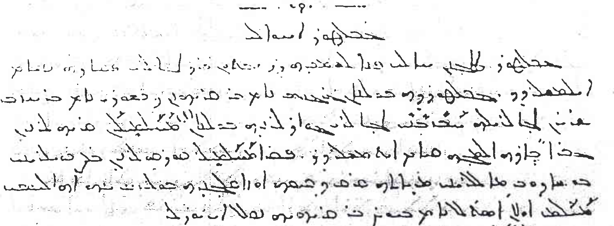


An Ottoman Turkish tautology


Wikipedia has an article on a place called [Pendle Hill](https://en.wikipedia.org/wiki/Pendle_Hill), noteworthy, perhaps, mainly for being a triple tautology:

> The name "Pendle Hill" combines the words for hill from three different languages ... In the 13th century it was called *Pennul* or *Penhul*, apparently from the Cumbric *pen* and Old English *hyll*, both meaning "hill". The modern English "hill" was appended later, after the original meaning of Pendle had become opaque.

This reminded me of a similar triple tautology I came across as a graduate student reading copies of a monthly journal from the early twentieth century.

Reading right-to-left, you can see it right there at the start of the second line: . That's *cebel* (Arabic for "mountain"), *tûr* (Syriac for "mountain") and *dağ* (Turkish for, you guessed it, "mountain").[^s]


The text above was written in Ottoman Turkish, and for consistency, I am using standard Turkish transliteration for all the foreign language words. It's worth pointing out that *cebel* is pronounced "jebel".


The "mountain" in question here was actually the [Tur Abdin](https://en.wikipedia.org/wiki/Tur_Abdin) region in modern Turkey, ironically a region that has no mountains and can be described as hilly at best.

As a small aside, the journal *Mürşid-i Âsûriyûn* that this place name came from is interesting a in a few ways:
* If the image above looks handwritten, that's because it was. The publisher, Âşûr Yûsuf, printed copies using a technique called [mimeography](https://en.wikipedia.org/wiki/Mimeograph).
* The journal existed between 1909 and 1914 in the ancient city of Harpût, then a provincial capital and was mailed to subscribers across the Ottoman Empire and as far away as the United States.
* Ottoman Turkish was usually written using the Arabic alphabet, but Âşûr Yûsuf used the Syriac alphabet in *Mürşid-i Âsûriyûn*.
* This was the first journal to be printed in Ottoman Turkish with Syriac letters, but it was followed by several more. You could still find them being published in Lebanon and the United States into the 1930s.

|Syriac | Arabic | Latin |
| :---: | :----: | :---: |
|||*cebel*|
|||*tûr*|
|||*dağ*|

Âşûr Yûsuf was a native speaker of Armenian and he did *not* know the Syriac language, despite identifying as a Syriac (*Süryânî*) and an Assyrian (*Âsûrî*). Like any other speaker of Ottoman Turkish, he would have been well-acquainted with the common word *cebel* despite not speaking Arabic himself.

It's interesting to compare his usage to some other notable topological features in the Ottoman Empire:
* Mount Sinai is  (*Cebel et-Tûr*) in Arabic and was  (*Cebel&#8209;i Tûr*) in Ottoman Turkish.[^t]
* The Mount of Olives near Jerusalem was also *Cebel&#8209;i Tûr* (although it is simply  in Arabic).
* Mount Gerizim near Nablus is another *Cebel et-Tûr*.

In the Arabic and the Ottoman cases where we find both *cebel* and *tûr*, speakers would have understood these names to mean something like "Tûr Mountain".

When I originally read the passage above, I also transliterated the place name as *Cebel&#8209;i Tûr Dağı*, but looking at the text again, I can see that the author intended it to be read *Cebeltûr Dağı*. My original reading would have required a space between the first two words, so , but that space is quite clearly not there.

And that, I suppose, is the difference. *Cebel-i Tûr* (with a space) was "Mount Tûr" and no *Dağ* was necessary or even possible. But *Cebeltûr* (no space) had become a set phrase much like *Penhul*. And it was acceptable for a Turkish-speaker to call this place *Cebeltûr Dağı*: "Mount Cebeltûr".

[^s]: Observant readers will note that it is actually  in the original text but the final two characters are the Turkish grammatical suffix *-ının* which we can ignore.
[^t]: In Turkish today, *Tûr Dağı* has replaced the [Persian grammatical construct](https://en.wikipedia.org/wiki/Ez%C4%81fe) which you see in *Cebel-i Tûr*. And both now and then, Mount Sinai had many different names, including *Cebel-i Sînâ*.
