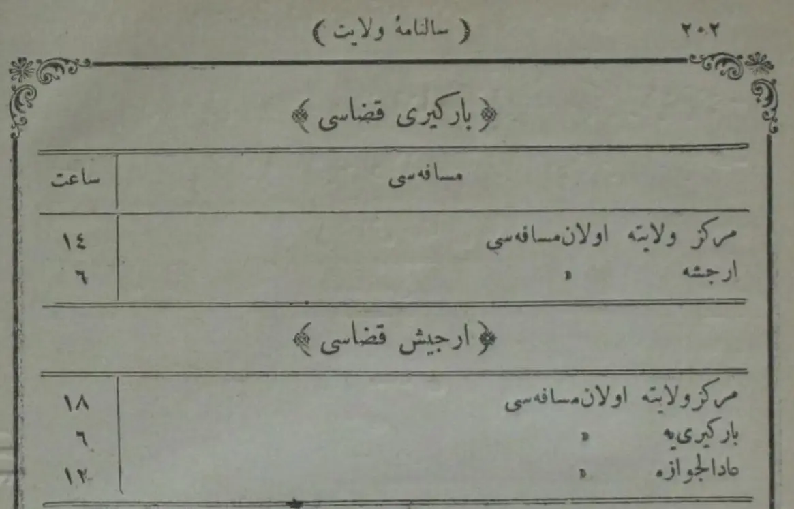
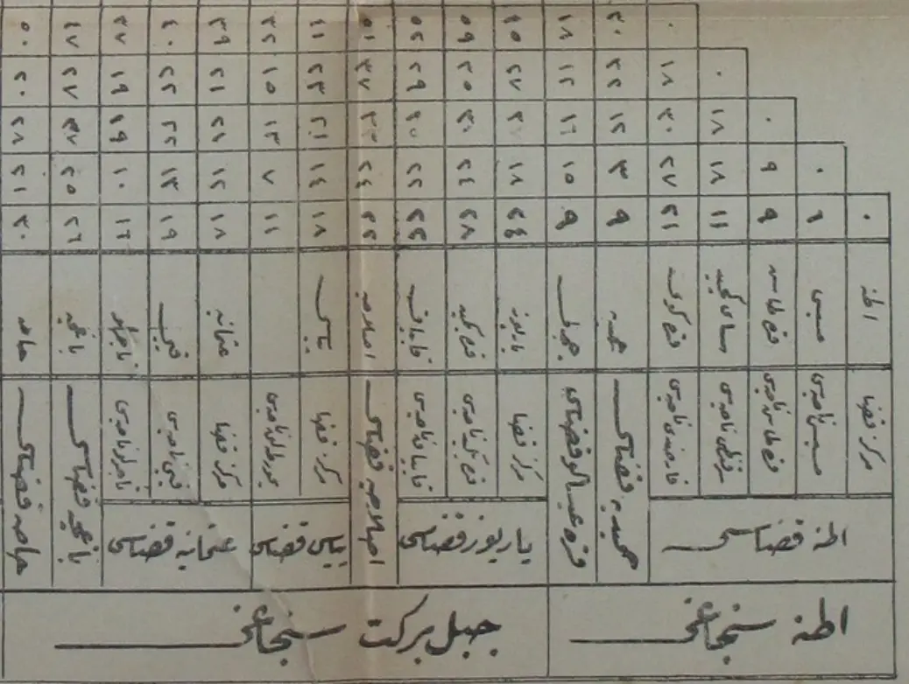
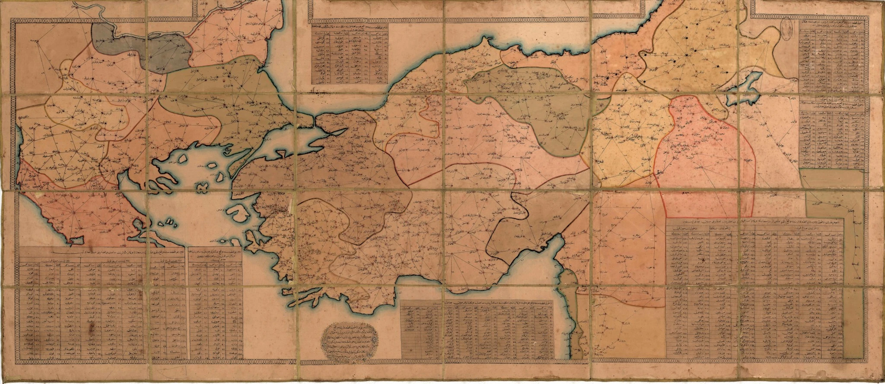
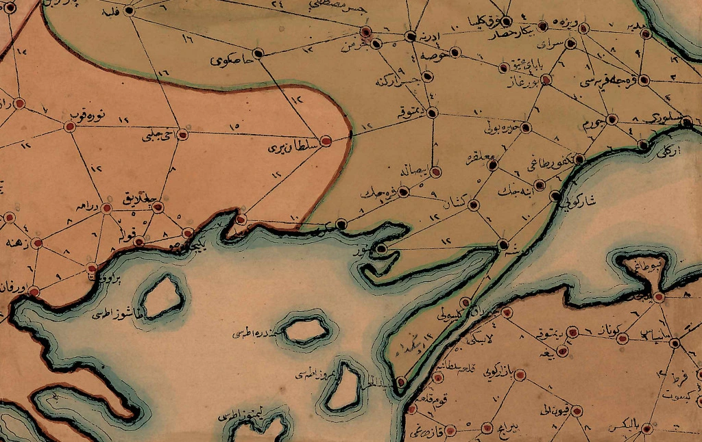
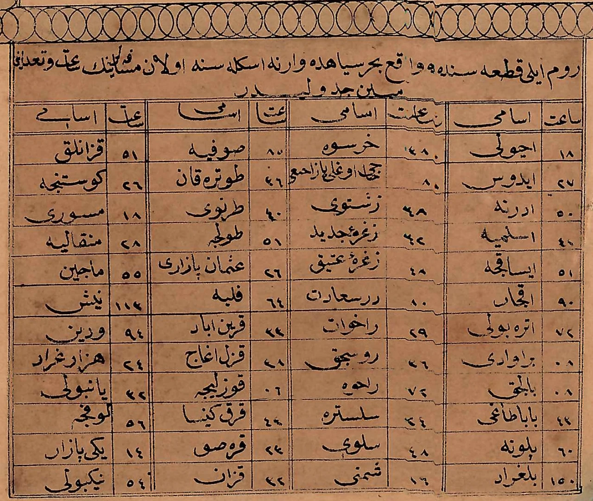
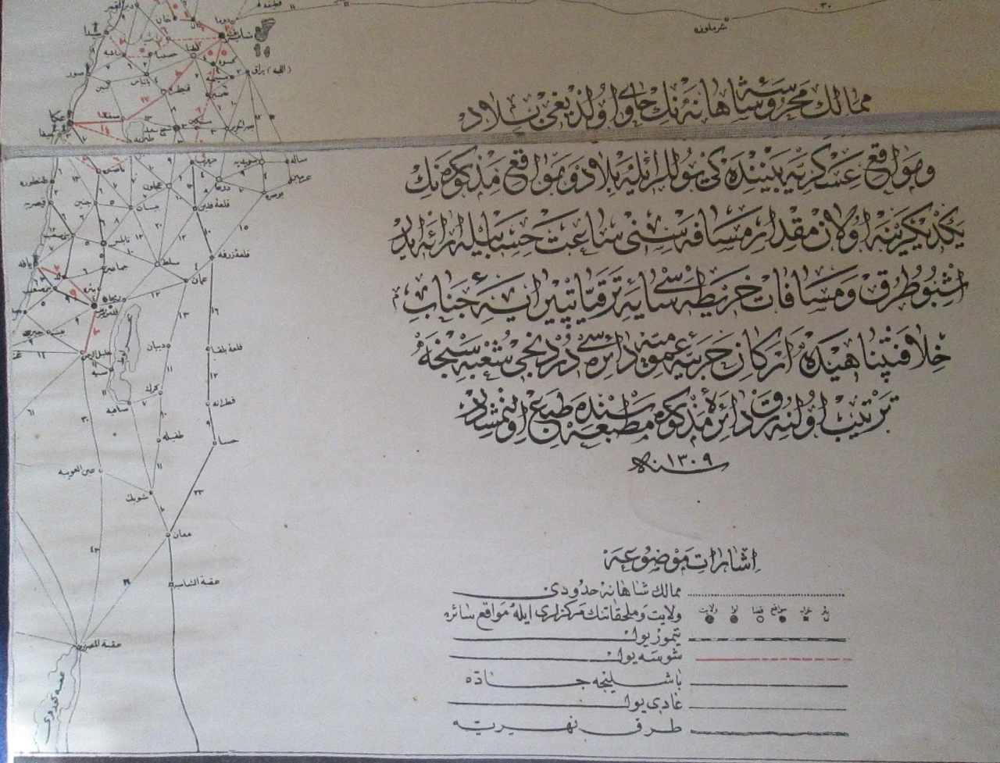
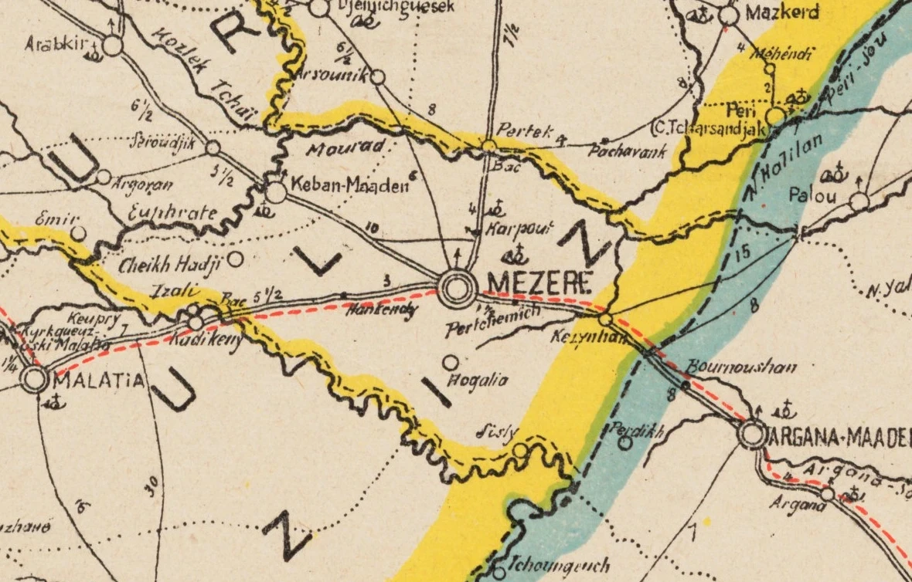
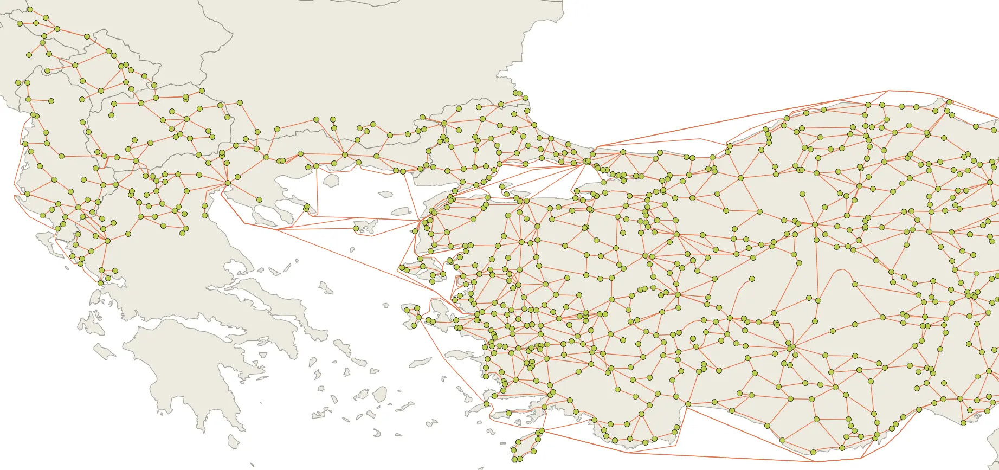
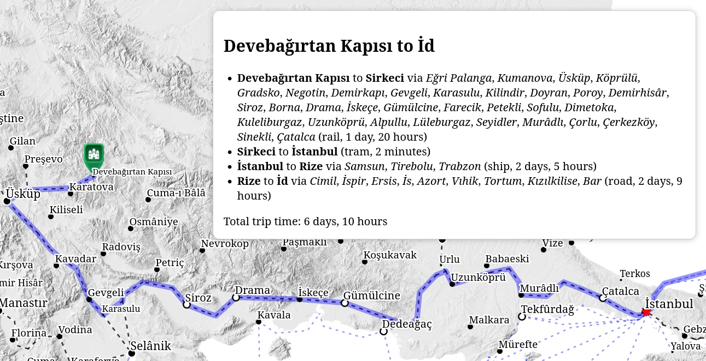


A geospatial solution to Ottoman travel times


Imagine you were a bureaucrat in the Ottoman government and your posting as assistant governor of the province of Sivas had ended and you were about to take up a position on a commission in the city of Selânik (Thessaloniki).[^cercis]

How would you have made that journey? How long would it have taken?

As a graduate student, I had come across raw data on travel times in some Ottoman primary sources, and this raw data can be fed into a routing engine to calculate the optimal journey for our imaginary Ottoman. This is how I found the data and built the engine.

## The Data

### *Sâlnâme*s

The first sources are the provincial *sâlnâme*s, annals or almanacs published by the governments of each *vilâyet* (province) from the mid-1860s onwards. The *sâlnâme*s contain a wealth of information of interest to a researcher, including administrative, demographic and economic data; in addition, many *sâlnâme*s also include lists or tables giving travel times between important settlements inside the province or between the province and other important Ottoman cities.

#### *Sâlnâme-i Vilâyet-i Van*

As an example, the yearbook for Van from 1315 [1897/1898] has a list of travel times for the provincial capital and district centres.

<table class="tg">
<thead>
  <tr>
    <th class="tg-2zis" colspan="2">Bargiri kazâsı [Bargiri district]</th>
  </tr>
</thead>
<tbody>
  <tr>
    <td class="tg-1zis">mesâfesi [distance]</td>
    <td class="tg-1zis">sâat [hours]</td>
  </tr>
  <tr>
    <td class="tg-pjk6">merkez-i vilâyete olan mesâfesi [distance to the provincial centre]</td>
    <td class="tg-1zis">14</td>
  </tr>
  <tr>
    <td class="tg-pjk6">Erciş'e olan mesâfesi [distance to Erciş]</td>
    <td class="tg-1zis">6</td>
  </tr>
  <tr>
    <td class="tg-2zis" colspan="2">Erciş kazâsı [Erciş district]</td>
  </tr>
  <tr>
    <td class="tg-pjk6">merkez-i vilâyete olan mesâfesi [distance to the provincial centre]</td>
    <td class="tg-1zis">18</td>
  </tr>
  <tr>
    <td class="tg-pjk6">Bargiri'ye olan mesâfesi [distance to Bargiri]</td>
    <td class="tg-1zis">6</td>
  </tr>
  <tr>
    <td class="tg-pjk6">Âdilcevâz'a olan mesâfesi [distance to Âdilcevâz]</td>
    <td class="tg-1zis">12</td>
  </tr>
</tbody>
</table>

#### *Sâlnâme-i Vilâyet-i Adana*

The Adana yearbook from 1318 [1900/1901] presents similar information but in table format.

### Maps

In aggregate, the provincial *sâlnâme*s have a tremendous amount of data in them, and it would be possible to reconstruct a graph of travel times for the entire Ottoman Empire. This was briefly my initial approach but I found that this work had already done by contemporary cartographers and that several maps could be leveraged to ease the process.

#### Ottoman map from 1855/1856

The oldest map that I have found dates back to 1272 [1855/1856], although the border with the Kingdom of Greece does not appear to match the actual border in 1855 (or any other year). The map is entirely in Ottoman Turkish.

* Every point-to-point connection has a travel time indicated.
* Approximate *vilâyet* borders are shown.
* There are tables showing travel times from Istanbul, Samsun, Trabzon, Varna, İzmir and Selânik.
* Maritime connections are not shown.
* Bosnia and everything north of the Danube are omitted.
* Most of Iraq and everything south of Damascus are omitted.

#### Ottoman map from 1891/1892

The second map dates from 1309 [1891/1892] and is also in Ottoman Turkish. It provides significantly more detail than the previous map, including in areas which were never or no longer part of the Ottoman Empire.[^danforth]

* Most point-to-point connections have travel times. The missing times are typically for regions outside the Ottoman Empire, but there are exceptions.
* The symbology of settlements differs depending on their administrative function (e.g. the administrative centre of a *vilâyet* is different from that of a *kazâ*).
* Four different types of connections are shown: railroads, *chaussée*s, main roads and roads.
* Maritime connections are not shown.
* Travel times between major ports are shown as a table.

#### French map from 1899

The final map is the work of one R. Huber and is based off of the 1317 [1899] *sâlnâme*. Unlike the previous two maps, it is not in Ottoman Turkish, but French, and it has less detail.

* Most point-to-point connections have travel times. Rail connections are measured in kilometres.
* *Vilâyet* and *sancak* borders are shown.
* Population figures and other figures are given for administrative subdivisions.
* The symbology of settlements differs depending on their administrative function (e.g. the administrative centre of a *vilâyet* is different from that of a *kazâ*).
* Four different types of connections are shown: railroads, projected railroads, *chaussée*s, roads and maritime routes.

## The Engine

As a proof-of-concept, I digitised a significant part of the 1899 map, encoding the settlements as points and the connections between them as lines in a [PostgreSQL](https://www.postgresql.org/) database with [PostGIS](https://postgis.net/) support.

Network analysis for point-to-point travel is a well-understood problem, and [pgRouting](https://pgrouting.org/) implements [Dijkstra's algorithm](https://en.wikipedia.org/wiki/Dijkstra's_algorithm) to find the lowest-cost path between two nodes, using the hours listed on the map as the cost of each edge.

Using Dijkstra's algorithm and the data from the 1899 map, I calculated the optimal route between Sivas and Selânik would have taken almost five days:

* Sivas to Tokat via Kargın (road, 16h)
* Tokat to Ünye via Gümenek, Niksar, Karakuş (chaussee, 1 day, 5 hours)
* Ünye to Selânik via Samsun, İstanbul, Gelibolu, Çanakkale (ship, 3 days)

## An Application

I published a simple web application as "Ottoman Route Finder" at https://www.jaxartes.net/ottoman-route-finder/ so anyone can calculate that it takes about six days and ten hours to travel from Devebağırtan Kapısı to İd.

In addition to PostgreSQL, PostGIS and pgRouting, I am using [OpenLayers](https://openlayers.org/) as a web-mapping library.

<video controls>
<source src="orf.mp4" type="video/mp4" preload="auto">
</video>

### Limitations

* The application is only as good as the input data so I am relying on the mapmakers' and *sâlnâme* authors' accuracy.
* In some cases, maps show connections but there is no travel time given; in those cases, I estimated the travel time based on the connection type and the typical time needed to travel that distance based on other connections in the map. This assumption may be wrong.
* In most cases, rail and tram travel times are also estimates. Only in some cases is accurate data available (for example Mudanya to Bursa).
* In all cases, the stated times are just the *travel* times and do not include any time spent waiting for onward transportation or time spent at intermediary points.

### To do

- [ ] Land routes in Rumeli
- [ ] Land routes in Anatolia
- [ ] Land routes in Mesopotamia
- [ ] Land routes in the Levant
- [ ] Land routes in Arabia
- [x] Beirut-Damascus railroad
- [x] Named lines, e.g. *İzmir-Aydın Demiryolu*
- [ ] penalty for switching lines
- [ ] Beirut tramway stations
- [ ] Damascus tramway
- [ ] Tripoli tramway
- [ ] Salonica tramway
- [ ] Aleppo tramway
- [ ] İzmir tramway
- [x] Jezreel Valley railway
- [x] Bosra railway
- [ ] Jaffa-Jerusalem railway
- [ ] *Şirket-i Hayriye* and other ferries
- [ ] Hejaz railroad

### Other sources

Besides the maps, I referenced many other sources, in particular for train travel details.

* [Trains of Turkey](http://www.trainsofturkey.com/)
* [Bursa Seyahatim](https://www.facebook.com/TariheSeyahat/posts/152795400716778/)
* [Steam over Macedonia](https://archive.org/details/steamovermacedon00goun/page/n3/mode/2up)
* [The Taurus Express to Iraq and Egypt](https://retours.eu/en/51-taurus-express-iraq-egypt/)
* [Beirut Train](https://www.cantab.net/users/brian.walling/MiddleEast/2020%2008%2016%20Beirut%20train%20text%20v2.0.pdf)
* [Land Transportation in Istanbul](https://istanbultarihi.ist/583-land-transportation-in-istanbul)
* [Osmanli Devleti’nde Demiryolu Ulaşımı](https://www.academia.edu/94990395/Osmanli_Devleti_nde_Demiryolu_Ula%C5%9F%C4%B1m%C4%B1_1913_Tarihli_%C5%9Eark_Ticaret_Y%C4%B1ll%C4%B1%C4%9F%C4%B1na_G%C3%B6re)
* [İstanbul'da Kara Ulaşımı](https://istanbultarihi.ist/assets/uploads/pdf/istanbulda-kara-ulasimi-219.pdf)
* [Actors of Change: Railway Projects and Urban Architecture of Balkan Cities in the Late Ottoman Period](https://etd.lib.metu.edu.tr/upload/12616073/index.pdf)
* [A Handbook of Bulgaria](https://dn721709.ca.archive.org/0/items/handbookofbulgar00grea/handbookofbulgar00grea.pdf)
* [A Handbook of Macedonia](https://digital.lib.auth.gr/record/150263/files/Auth%20Lib%20Handboo%20of%20Macedonia%20and%20surrounding%20territories.pdf)
* [A Handbook of Turkey in Europe](https://www.qdl.qa/en/archive/81055/vdc_100000000239.0x0001e2)
* [A Handbook of Mesopotamia](https://archive.org/details/handbkmesopotamiavol4corrections/page/n333/mode/2up)
* [A Handbook of Syria](https://archive.org/details/handbksyria)
* A Handboook of Asia Minor, [volume 1](https://dn790007.ca.archive.org/0/items/handbookofasiami01greauoft/handbookofasiami01greauoft.pdf) and [volume 2](https://archive.org/details/handbkasiaminorvol2/page/535/mode/2up), [volume 3, part II](https://archive.org/details/handbkasiaminorvol3pt2/page/n9/mode/2up)
* [A Handbook on Northern Palestine and Southern Syria](https://nla.gov.au/nla.obj-233087803/view)
* [Greek Rail Tickets](https://www.greekrailtickets.gr/)
* [Levantine Heritage](https://www.levantineheritage.com/aidin-personnel.html)
* [Les tramways belges dans l’Empire ottoman](https://www.levantineheritage.com/pdf/Empire-ottoman-Dussart-Desart.pdf)
* [Ameli Elektrik](https://archives.saltresearch.org/handle/123456789/129281)

### Changelog

* `2024-12-22`: add icons and collapsable details
* `2024-12-24`: add options menu
* `2024-12-26`: add a right click dialog menu to select the route origin or destination
* `2024-12-29`: switch to a materialized view in PostgreSQL to reduce the query overhead
* `2024-12-29`: replace [GeoServer](https://geoserver.org/) with a light-weight server

[^cercis]: This is loosely based on the actual case of Cercîs Efendi, a Syriac Christian who held these positions in the late nineteenth and early twentieth centuries. He later lived in Samsun on the Black Sea coast.
[^danforth]: I believe this map came to me from Nick Danforth of http://www.midafternoonmap.com/ fame.
