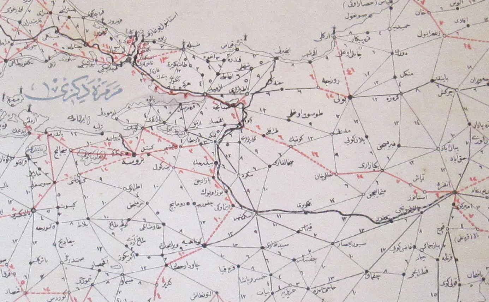


A geospatial solution to Ottoman travel times


Imagine you were a bureaucrat in the Ottoman government and your posting as assistant governor of the province of Sivas had ended and you were about to take up a position on a commission in the city of Selânik (Thessaloniki).[^cercis]

How would you have made that journey? How long would it have taken?

These are the types of questions that I want to answer, and it turns out a lot of raw data on travel times in the Ottoman era actually exists, and that raw data can be fed into a routing engine to calculate the optimal journey for our imaginary Ottoman. This is how I found the data and built the engine.

## The Data

### *Sâlnâme*s

The first sources are the provincial *sâlnâme*s, annals or almanacs published by the governments of each *vilâyet* (province) from the mid-1860s onwards.

")

<table class="tg">
<thead>
  <tr>
    <th class="tg-2zis" colspan="2">Bargiri kazâsı</th>
  </tr>
</thead>
<tbody>
  <tr>
    <td class="tg-1zis">Mesâfesi</td>
    <td class="tg-1zis">Sâat</td>
  </tr>
  <tr>
    <td class="tg-pjk6">Merkez-i vilâyete olan mesâfesi</td>
    <td class="tg-1zis">14</td>
  </tr>
  <tr>
    <td class="tg-pjk6">Erciş'e olan mesâfesi</td>
    <td class="tg-1zis">6</td>
  </tr>
  <tr>
    <td class="tg-2zis" colspan="2">Erciş kazâsı</td>
  </tr>
  <tr>
    <td class="tg-pjk6">Merkez-i vilâyete olan mesâfesi</td>
    <td class="tg-1zis">18</td>
  </tr>
  <tr>
    <td class="tg-pjk6">Bargiri'ye olan mesâfesi</td>
    <td class="tg-1zis">6</td>
  </tr>
  <tr>
    <td class="tg-pjk6">Âdilcevâz'a olanmesâfesi</td>
    <td class="tg-1zis">12</td>
  </tr>
</tbody>
</table>

")

It would be possible to painstakingly reconstruct a network of locales recorded in each province's *sâlnâme*, but there is something better.

### Maps

#### Ottoman map from 1855/1856

The oldest map that I have found dates back to 1272 [1855/1856], although the border with the Kingdom of Greece does not appear to match the actual border in 1855 (or any other year). The map is entirely in Ottoman Turkish.

* Every point-to-point connection has a travel time indicated.
* Approximate *vilâyet* borders are shown.
* There are tables showing travel times from Istanbul, Samsun, Trabzon, Varna, İzmir and Selânik.
* Maritime connections are not shown.
* Bosnia and everything north of the Danube are omitted.
* Most of Iraq and everything south of Damascus are omitted.

#### Ottoman map from 1891/1892

The second map dates from 1309 [1891/1892] and is also in Ottoman Turkish. It provides significantly more detail than the previous map, including in areas which were never or no longer part of the Ottoman Empire.[^danforth]

* Most point-to-point connections have travel times. The missing times are typically for regions outside the Ottoman Empire, but there are exceptions.
* The symbology of settlements differs depending on their administrative function (e.g. the administrative centre of a *vilâyet* is different from that of a *kazâ*).
* Four different types of connections are shown: railroads, *chaussée*s, main roads and roads.
* Maritime connections are not shown.
* Travel times between major ports are shown as a table.

#### French map from 1899

The final map is the work of one R. Huber and is based off of the 1317 [1899] *sâlnâme*. Unlike the previous two maps, it is not in Ottoman Turkish, but French, and it has less detail.

* Most point-to-point connections have travel times. Rail connections are measured in kilometres.
* *Vilâyet* and *sancak* borders are shown.
* Population figures and other figures are given for administrative subdivisions.
* The symbology of settlements differs depending on their administrative function (e.g. the administrative centre of a *vilâyet* is different from that of a *kazâ*).
* Four different types of connections are shown: railroads, projected railroads, *chaussée*s, roads and maritime routes.

## The Engine

As a proof-of-concept, I digitised a significant part of the 1899 map, encoding the settlements as points and the connections between them as lines in a [PostgreSQL](https://www.postgresql.org/) database with [PostGIS](https://postgis.net/) support.

Network analysis for point-to-point travel is a well-understood problem, and [pgRouting](https://pgrouting.org/) implements [Dijkstra's algorithm](https://en.wikipedia.org/wiki/Dijkstra's_algorithm) to find the lowest-cost path between two nodes, using the hours listed on the map as the cost of each edge.

Using Dijkstra's algorithm and the data from the 1899 map, I calculated the optimal route between Sivas and Selânik would have taken approximately four days:

* Sivas to Tokat via Kargın (road, 16h)
* Tokat to Ünye via Gümenek, Niksar, Karakuş (chaussee, 1d)
* Ünye to Selânik via Samsun, İstanbul, Gelibolu, Çanakkale (ship, 2d)

## An Application

I published a simple web application as "Ottoman Route Finder" at https://jaxartes.net/orf/ so anyone can calculate that it takes about six days and ten hours to travel from Devebağırtan Kapısı (me neither) to İd.

In addition to PostgreSQL, PostGIS and pgRouting, the tech stack includes [GeoServer](https://geoserver.org/) to expose the database via a Web Feature Service (WFS) and [OpenLayers](https://openlayers.org/) as a web-mapping library.

<video controls>
<source src="orf.mp4" type="video/mp4" preload="auto">
</video>

### Limitations

* The application is only as good as the input data so I am relying on the mapmakers' and *sâlnâme* authors' accuracy.
* Timetables for the railways are not available, so the travel times that you see are very much how long someone would have literally been travelling as opposed to how long it would have taken end-to-end.
* In some cases, maps show connections but there is no travel time given; in those cases, I estimated the travel time based on the connection type and the typical time needed to travel that distance based on other connections in the map. This assumption may be wrong.
* I added ferries across the Bosphorus and known tramlines inside Istanbul, but I do not have timetables for these, so durations are estimated.
* Since the railway connections are measured in kilometres rather than hours, I also estimated those.
* I did not complete my digitisation of the 1899 map, but it does include the Balkans and most of Anatolia.

[^cercis]: This is loosely based on the actual case of Cercîs Efendi, a Syriac Christian who held these positions in the late nineteenth and early twentieth centuries. He later lived in Samsun on the Black Sea coast.
[^danforth]: I believe this map came to me from Nick Danforth of http://www.midafternoonmap.com/ fame.
